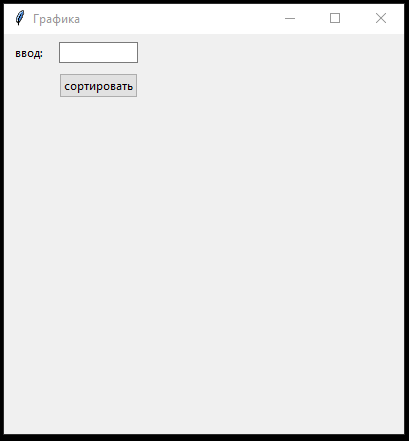
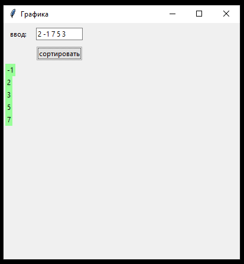

# Лаба 5.0 python (модуль tkinter), ГРАФИКА В PYTHON, ОТЛОЖЕННОЕ ОБНОВЛЕНИЕ (after), ДИНАМИЧЕСКОЕ ИЗМЕНЕНИЕ, СОРТИРОВКА ПУЗЫРЬКОМ, зачет, Корчагин Д., ЯМП, 2 сем, 2 к, ПМИ

<h3>Условие фото:</h3>

<h3>Условие текст:</h3>

Лабораторная 5 (python):
Реализовать интерфейс для интерактивной сортировки пузырьком:
На экране поле ввода и кнопка отсортировать, вводим в поле числа через запятую, нажимаем "отсортировать".
Под полем и кнопкой отрисовывается введенный список (в столбик), после чего он начинает сортироваться со скоростью один шаг в секунду. (для отложенного обновления используем функцию after: https://tkdocs.com/tutorial/eventloop.html).
Уже отсортированные элементы массива меняют цвет текста на зеленый.

Пока сортировка не закончится, поле ввода и кнопка блокируются, после окончания сортировки можно ввести новый массив.

<h3>Инфо о вузе (где и когда дали условие лабы):</h3>
<b>Факультет:</b> ПММ
 
<b>Специальность:</b> ПМИ
 
<b>Курс:</b> 2
 
<b>Семестр:</b> 2
 
<b>Предмет:</b> ЯМП
 
<b>Преподаватель:</b> Корчагин Д.
 
<b>Тип сдачи:</b> Зачет
 
<b>Год сдачи:</b> 2022

<h3>Подробнее инфа о условии лабы (от кудова ее взяли):</h3>
<b>Номер лабы:</b> 5
 
<b>Вариант лабы:</b> 0
 
<b>У кого взял код:</b> Смирнова Лариса
 
Давал каждому в дискорде присылая сообщением

<h3>Тема лабы:</h3>
<b>Темы:</b> 

  Графика в python, динамическое изменение  
  Отложенное обновление (after)   
  Массив изменяется прямо на глазах (раз в 1 секунду) 
  После полной сортировки загарается зеленым цветом    
  
  <pre>buton.state(["disabled"])</pre> Замораживает элемент окна (нельзя на него нажать)

<b>Используемые объекты:</b>
<pre>
  after, buton.state(["disabled"]), columnconfigure, rowconfigure, Frame, tkinter (ttk)
</pre>

<h3>Комментарии к этой лабе (к решению этой лабы в этом проекте):</h3>

 <b>все работает, все запускается</b>  
  
  <b>Входные данные</b>  
  Массив чисел в строку Н: <pre>2 3 -1 7 -17 23</pre> </b>

**Пример того что получилось, если выполнить код:**  
  
**Пример того что получилось, если ввести данные в поле ввода:**  

<h3>commit/branch:</h3>

    одна ветка

